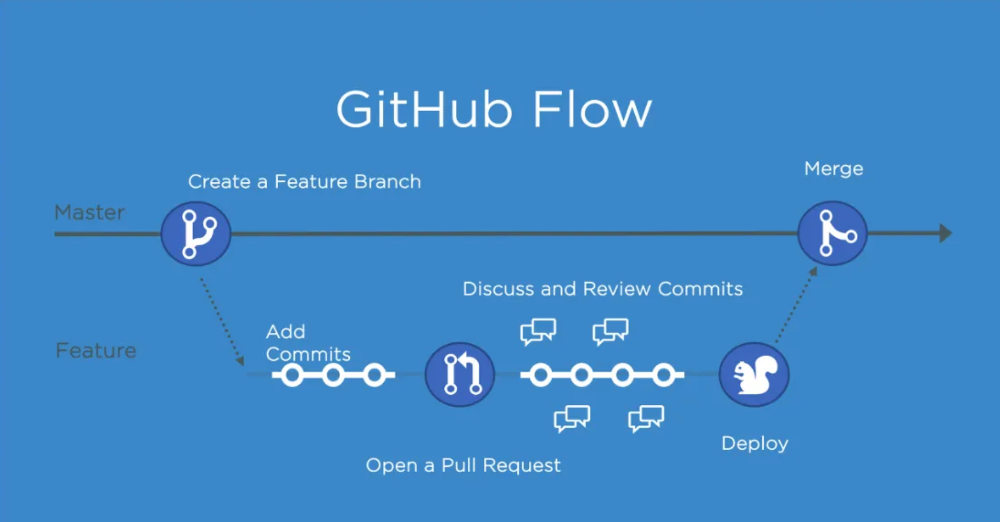
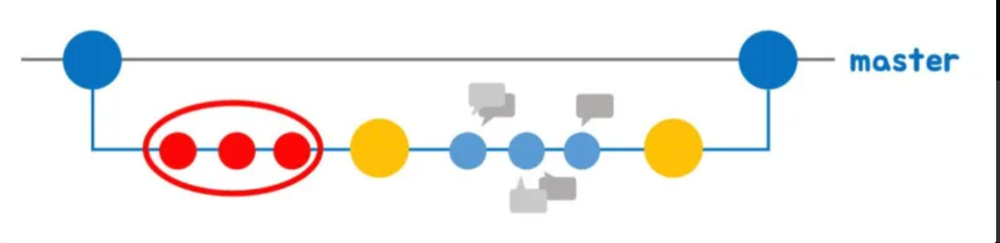

## Github-Flow 전략

- Git flow가 좋은 방식이지만 GitHub에 적용하기에는 **복잡**하다는 Scott Chacon의 판단에 따라 만들어진 새로운 깃 관리 방식입니다.
- **자동화 개념이 들어가 있다**라는 큰 특징이 존재하며 만일 자동화가 적용되어 있지 않은 곳에서만 수동으로 진행하면 됩니다.
- Git flow에 비해 흐름이 단순해졌습니 다.
  **단순해짐에 따라 그 규칙도 단순**
- 기본적으로 master branch에 대한 규칙만 정확하게 정립되어 있다면 나머지 가지들에 대해서는 특별한 관여를 하지 않으며 pull request기능을 사용하도록 권장합니다.

### Github-flow 특징

- release branch가 명확하게 구분되지 않은 시스템에서 사용이 유용합니다.
- Github 자체의 서비스 특성상 배포의 개념이 없는 시스템으로 되어있기 때문에 이러한 flow 가 유용합니다.
- 웹 서비스에 배포의 개념이 없어지고 있는 추세인가? (추가적으로 알아보아야함)
- hotfix와 같은 작은 기능을 구분하지 않습니다. 모든 구분사항들도 결국 개발자가 전부 수정하는 일들 중 하나라고 보는것이고 우선순위가 어떤것이 더 높은지에 대한 것을 판단합니다.

### Github-flow 흐름

### 1. 브랜치 생성

Github-flow 전략은 개능 개발이나 버그 픽스등 어떤 이유로든지 새로운 브랜치를 생성하게 됩니다.

단 이때 체계적인 분류 없이 브랜치 하나에 의존하기 때문에 브랜치 이름을 통해 의도를 명확하게 드러내야 합니다. 즉 컨밴션을 잘 지켜야합니다.

- master 브랜치는 항상 최신 상태이며, stable 상태로 product에 배포되는 브랜치 입니다. 이 브랜치는 엄격한 role 과 합께 사용하게 됩니다.
- 새로운 브랜치는 항상 master 브랜치에서 만들게 됩니다.
- git-flow와는 다르게 feature 브랜치나 develop브랜치가 존재하지 않습니다.
- 그렇기 때문에 브랜치 이름이 중요합니다.

### 2. 개발 & 커밋 & 푸시

개발을 진행하면서 커밋을 남긴다.이때도 브랜치와 같이 커밋 메세지에 의존해야 하기 때문에, 커밋 메세지를 최대한 상세하게 적어주는 것이 중요합니다.

- **커밋메시지를 명확하게 작성하자**
- 원격지 브랜치로 **수시로 push** 하자
- Git-flow와 상반되는 방식
- 항상 원격지에 자신이 하고 있는 일들을 올려 다른 사람들도 확인할 수 있도록 해줍니다
- 이는 하드웨어에 문제가 발생해 작업하던 부분이 없어지더라도, 원격지에 있는 소스를 받아서 작업할 수 있도록 해줍니다

### 3.PR(Pull Request)생성

피드백이나 도움이 필요할 때, 그리고 merge 준비가 완료되었을 때는 pull request를 생성합니다

- pull request는 **코드 리뷰**를 도와주는 시스템
- 이것을 이용해 자신의 코드를 공유하고, 리뷰받습니다.
- merge 준비가 완료되었다면 master 브랜치로 반영을 요구합니다

### 4. 리뷰 & 토의

Pull-Request가 master 브랜치 쪽에 합쳐진다면 곧장 라이브 서버에 배포되는 것과 다름 없으므로, 상세한 리뷰와 토의가 이루어져야 합니다.

### 5. 테스트

리뷰와 토의가 끝났다면 해당 내용을 라이브 서버 (혹은 테스트 환경)에 배포해봅니다.

배포시 문제가 발생한다면 바로 master 브랜치의 내용을 다시 배포해서 초기화 시킵니다.

### 6. 최종 Merge

라이브 서버 (혹은 테스트 환경)에 배포해도 문제가 발견되지 않았다면 그대로 master 브랜치에 푸시를 하고 즉시 배포를 진행합니다.

**master로 merge되고 push 되었을 때는, 즉시 배포되어야한다**

- GitHub-flow의 핵심
- master로 merge가 일어나면 자동으로 배포가 되도록 설정해놓습니다. (CI / CD)
