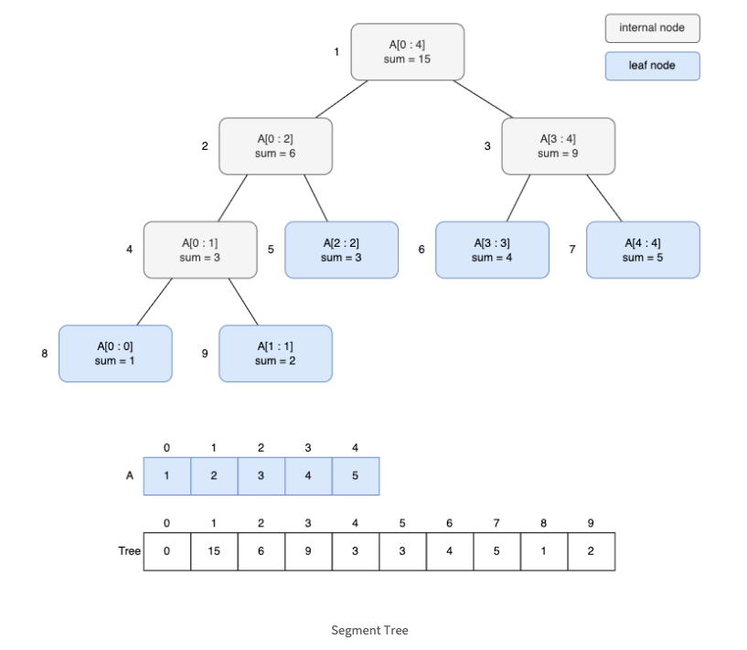
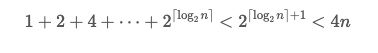
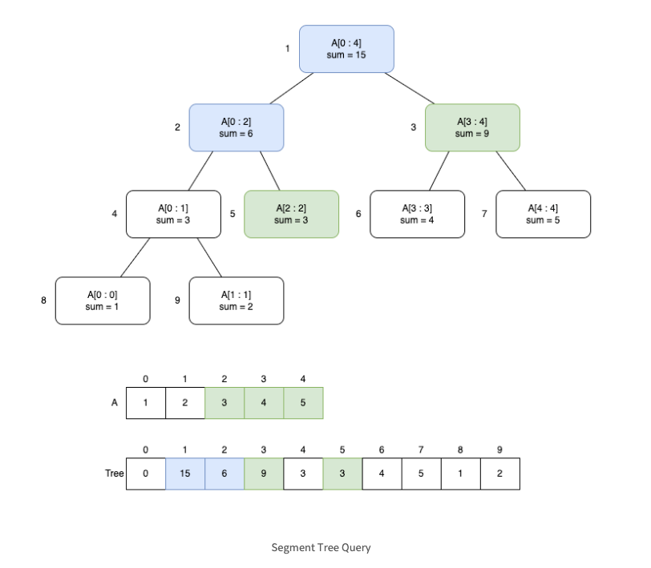
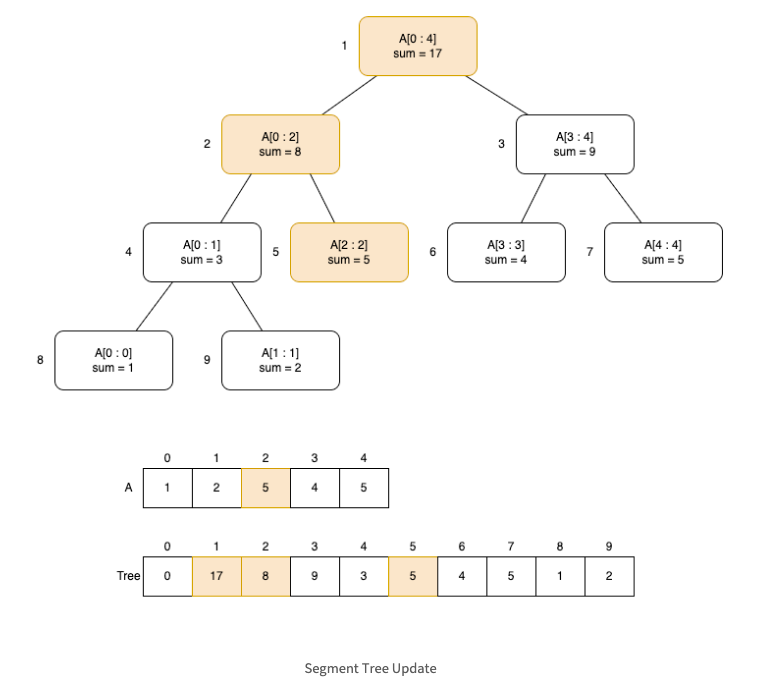
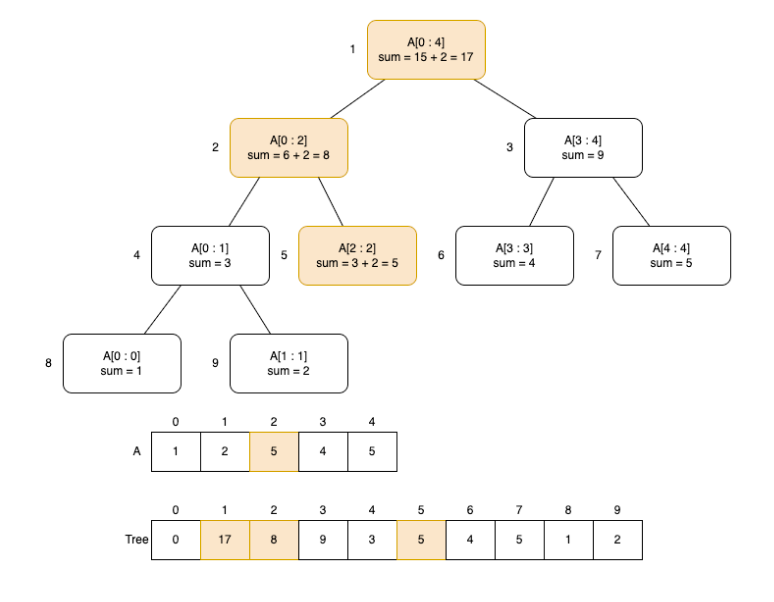

## 세그먼트 트리 (Segment Tree)

---

세그먼트 트리(Segment Tree)는 배열 간격에 대한 정보를 이진 트리에 저장하는 자료구조입니다.

### 예시

A = {1, 2, 3, 4, 5 … ,N} 라는 배열에 아래 연산을 M번 수행한다고 생각해봅시다.

1. 배열의 범위 합을 구하는 Query 연산

- A[0] + A[1] + A[2] + … + A[N-1]

2. i번째 배열 값을 v로 변경하는 Update 연산

- A[i] = v

단순한 방법으로 각 배열에 접근해서 연산을 하면

1번 연산 O(N), 2번 연산 O(1)이 됩니다.

이 두 연산을 M번 수행 한다면 총 시간 복잡도는 O(MN) 이 됩니다.

---

이런 경우 즉 배열의 범위합을 구하는 (연속 합) 및 그 중간의 값이 Update 되는 연산이 필요할때

세그먼트 트리를 사용하면 MlogN 의 시간으로 개선시킬수 있습니다.

---

### 세그먼트 트리 구성

세그먼트 트리는 이진 트리로 간단한 선혈 배열을 사용하여 나타낼수 있습니다.

부모 노드의 인덱스가 i라면 2i는 왼쪽 자식 노드이고 2i+1은 오른쪽 자식 노드 입니다.

세그먼트 트리의 각 노드에는 구간 정보가 저장되어 있습니다.
예시: 구간합, 구간 최대/최소합

다음은 배열 A = {1,2,3,4,5} 에 대한 세그먼트 트리를 시각화한 그림입니다.

        15
       /  \
      6    9
     / \  / \
    3  3 7   2

/ \
 1 2

리프 노드: 배열의 실제 값 (1, 2, 3, 4, 5)
내부 노드: 자식 노드의 합 (예: 1 + 2 = 3, 3 + 3 = 6 등)

각 노드에는 배열의 구간합이저장되어 있고 리프노드에는 주어진 배열(A)의 값이 저장되고 내부노드에는 자식 노드의 합이 저장됩니다.

---

### 세그먼트 트리 구현

세그먼트 트리에는 세가지 (Build, Query, Update) 작업이 있습니다.

세그먼트 트리는 전 이진트리 입니다. 따라서 크기가 n인 배열을 가지고 리프 노드가 n개인 세그먼트 트리를 만들때 필요한 노드수는

일반적으로 편의를 위해 4n 또는 2^(h+1)로 크기를 정하기도 합니다.

1. 세그먼트 트리 빌드하기 (Build)
   트리를 처음 만들 때 배열의 정보를 모두 저장하는 과정입니다.

### Build

구현은 다음과 같습니다.

- 세그먼트트리는 재귀를 사용하여 구축할수 있습니다.
- 트리를 순회하며 작업을 진행합니다.
  - 리프노드의 경우는 배열(A)의 요소를 저장
  - 내부노드라면 구간 정보를 저장 (두 자식노드의 합을 저장 또는 곱을 저장)

# Python

def build(node, start, end):
if start == end: # 리프 노드라면 원소를 저장한다.
tree[node] = A[start]
return
mid = (start + end) // 2 # 왼쪽 자식으로 재귀
build(node*2, start, mid) # 오른쪽 자식으로 재귀
build(node*2+1, mid+1, end) # 내부 노드라면 두 자식 노드의 합을 저장한다.
tree[node] = tree[node*2] + tree[node*2+1]
return

# JAVA

public class SegmentTree {
int[] tree;
int[] A;
int n;

    public SegmentTree(int[] A) {
        this.A = A;
        this.n = A.length;
        // 트리의 크기를 4n으로 설정 (안전하게 잡기 위해)
        tree = new int[4 * n];
        build(1, 0, n - 1);
    }

    private void build(int node, int start, int end) {
        if (start == end) {
            // 리프 노드: 배열의 값을 저장
            tree[node] = A[start];
            return;
        }

        int mid = (start + end) / 2;
        // 왼쪽 자식 빌드
        build(2 * node, start, mid);
        // 오른쪽 자식 빌드
        build(2 * node + 1, mid + 1, end);
        // 내부 노드: 자식의 합을 저장
        tree[node] = tree[2 * node] + tree[2 * node + 1];
    }

}

### Query

세그먼트 트리에서 구간 정보를 가져옵니다.
배열의 특정 구간 합을 빠르게 구하는 방법입니다.

- 트리를 순회
  - 노드가 나타내는 범위가 범위 밖이면 0을 반환
  - 노드가 나타내는 범위가 지정된 범위 내에 있으면 값을 반환
  - 노드가 나타내는 범위가 지정된 범위 일부만 포함 하면 왼쪽 자식과 오른쪽 자식의 합을 반환

여기서 2부터 4까지 구간합을 구하기 위해서는
초록색 값들을 사용해서 구합니다

- 여기서 노드가 나타내는 범위는 start end 이고 지정된 범위는 Left, Right 입니다

# Python

def query(node, start, end, left, right):
if right < start or end < left: # 노드가 지정된 범위 밖에 있는 경우
return 0

    if left <= start and end <= right:
    	# 노드가 지정된 범위 안에 있는 경우
    	return tree[node]

    # 노드가 지정된 범위 일부에 있는 경우
    mid = (start + end)//2
    left_child = query(node*2, start, mid, left, right)
    right_child = query(node*2+1, mid+1, end, left, right)

    return left_child + right_child

# JAVA

public int query(int node, int start, int end, int left, int right) {
if (right < start || end < left) {
// 범위 밖
return 0;
}

    if (left <= start && end <= right) {
        // 범위 안
        return tree[node];
    }

    // 범위 일부
    int mid = (start + end) / 2;
    int p1 = query(2 * node, start, mid, left, right);
    int p2 = query(2 * node + 1, mid + 1, end, left, right);

    return p1 + p2;

}

### Update

배열의 특정 값을 빠르게 수정하고, 그에 따라 세그먼트 트리도 업데이트하는 방법입니다.

index번째 A를 var값으로 변경하는 작업 (A[index] = var)
update는 index가 포함된 구간을 담당하는 노드들만 변경합니다.

예를 들어 A = {1,2,3,4,5} 배열에서 A[2] = 5로 변경할 때, 변경해야 하는 구간은 다음과 같습니다. 색깔 노드는 방문하여 변경하는 노드입니다.

구현은 다음과 같습니다.

- 트리를 순회합니다.
- index가 포함된 구간을 가지고 있는 자식 노드로 재귀합니다.
  - 리프 노드라면 배열 값을 변경합니다.
  - 내부 노드라면 구간 정보를 저장합니다. (예를 들어 구간 정보가 구간 합이라면 두 자식 노드의 합을 저장합니다.)

# Python

def update(node, start, end, index, val):
if start == end: # 리프 노드라면 배열 값을 변경한다.
tree[node] = val
return
mid = (start + end) // 2 # index가 포함된 구간을 가진 자식 노드로 재귀한다.
if start <= index and index <= mid:
update(2*node, start, mid, index, val)
else:
updaet(2*node+1, mid+1, end, index, val) # 내부 노드라면 두 자식 노드의 합을 저장한다.
tree[node] = tree[node*2] + tree[node*2+1]
return

# JAVA

public void update(int node, int start, int end, int index, int val) {
if (start == end) {
// 리프 노드: 값 수정
tree[node] = val;
return;
}

    int mid = (start + end) / 2;
    if (start <= index && index <= mid) {
        // 왼쪽 자식 업데이트
        update(2 * node, start, mid, index, val);
    } else {
        // 오른쪽 자식 업데이트
        update(2 * node + 1, mid + 1, end, index, val);
    }
    // 내부 노드: 자식의 합을 다시 저장
    tree[node] = tree[2 * node] + tree[2 * node + 1];

}

### Option

변화량을 사용한 구현

- 변화량(diff)을 사용하여 업데이트하는 방법도 있습니다.
- index 번째 배열 A를 val값으로 변경할 때 변화량은 diff = val - A[index]가 됩니다.
- index가 포함된 구간을 가진 노드들만 diff만큼 증가시키는 방식으로 구현합니다.

예를 들어 A = {1,2,3,4,5} 배열에서 A[2] = 5로 변경할 때, diff는 5 - 3 = 2가 되고 아래 색깔 노드만 diff만큼 증가시키면 됩니다.

# Python

def update(node, start, end, index, diff):
if index < start or end < index:
#index가 노드 범위 밖이면 탐색을 중단한다.
return # 노드를 diff 만큼 증가시킨다.
tree[node] += diff

    if start != end:
    	# 리프 노드가 아닌 경우 자식 노드를 update해준다.
    	mid = (start + end) // 2
    	update(node*2, start, mid, index, diff)
    	update(node*2+1, mid+1, end, index, diff)
    return

# JAVA

public void updateDiff(int node, int start, int end, int index, int diff) {
if (index < start || end < index) {
// 범위 밖
return;
}

    // 변화량 반영
    tree[node] += diff;

    if (start != end) {
        int mid = (start + end) / 2;
        updateDiff(2 * node, start, mid, index, diff);
        updateDiff(2 * node + 1, mid + 1, end, index, diff);
    }

}

---

## Segment Tree 를 활용하는 예시

실시간 재고 관리 시스템

상황 설명
온라인 쇼핑몰에서 제품의 재고를 실시간으로 관리할 때, 특정 범위 내의 제품 재고 합계를 빠르게 조회하거나, 특정 제품의 재고 수량을 업데이트해야 할 때.

적용 방법
세그먼트 트리를 이용하면 제품 범위에 대한 재고 합계를 빠르게 계산하고, 개별 제품의 재고를 효율적으로 업데이트할 수 있습니다.

예시
쿼리: 특정 카테고리 내의 제품 재고 합계
업데이트: 특정 제품의 재고 수량 변경

실시간 가격 변동 모니터링

상황 설명
전자상거래 플랫폼에서 상품의 가격이 실시간으로 변동될 때, 특정 카테고리의 가격 합계나 평균을 빠르게 계산하고 업데이트해야 하는 경우.

적용 방법
세그먼트 트리를 사용하면 가격의 합계나 평균을 효율적으로 관리할 수 있으며, 특정 상품의 가격 변경 시 빠르게 트리를 업데이트할 수 있습니다.

예시
쿼리: 특정 카테고리 내의 상품 가격 합계 또는 평균
업데이트: 특정 상품의 가격 변경

데이터베이스 인덱스 최적화
상황 설명
대규모 데이터베이스에서 특정 범위 내의 레코드 수를 빠르게 조회하거나 업데이트해야 할 때, 예를 들어 특정 조건을 만족하는 레코드의 수를 실시간으로 계산해야 하는 경우.

적용 방법
세그먼트 트리를 데이터베이스 인덱스와 결합하여 특정 범위 내의 레코드 수를 빠르게 계산할 수 있습니다. 예를 들어, 특정 필드의 값이 특정 범위 내에 있는 레코드 수를 효율적으로 관리할 수 있습니다.

예시
쿼리: 특정 필드의 값이 A부터 B 사이인 레코드 수
업데이트: 레코드의 필드 값 변경 시 트리 업데이트

## 언제 세그먼트 트리를 사용하고 언제 다른 자료구조를 사용해야 하나

세그먼트 트리 vs 이진 인덱스 트리 (Fenwick Tree/Binary Indexed Tree):

구현의 간편성: 세그먼트 트리 < 이진 인덱스 트리

지원하는 연산의 범위: 이진 인덱스 트리 < 세그먼트 트리

이진 인덱스 트리: 주로 점 업데이트와 구간 합계 쿼리에 최적화되어 있습니다.
세그먼트 트리: 구간 합계, 구간 최소/최대, 구간 곱셈 등 다양한 범위 쿼리를 지원할 수 있습니다.

공간 복잡도: 이진 인덱스 트리(n+1) > 세그 먼트 트리 (4n)

세그먼트 트리가 더 많은 메모리를 필요로 합니다.

이진 인덱스 트리: 일반적으로 n+1 크기의 배열을 사용합니다.
세그먼트 트리: 보통 4n 크기의 배열을 사용하여 더 많은 메모리를 필요로 합니다.

세그먼트 트리 vs 스플레이 or AVL 트리

세그먼트 트리와 이진 인덱스 트리는 고정된 크기의 배열을 기반으로 설계된 자료구조 입니다.
따라서 데이터의 크기가 동적으로 변하는 경우 (데이터 추가 또는 삭제) 효율적으로 대응하기 어렵습니다.

이럴때는 스플레이 트리나 AVL 트리 같은 균형 이진 탐색 트리가 더 적합합니다.

---

### 스플레이 트리 (Splay Tree):

특징: 최근에 접근된 노드를 트리의 루트로 이동시키는 특성이 있어, 특정 패턴의 접근에 유리합니다.
장점: 동적으로 데이터가 추가되거나 삭제될 때 자동으로 트리의 균형을 조절하여, 최악의 경우에도 시간 복잡도를 O(log N)으로 유지할 수 있습니다.
적용 사례: 캐시 시스템, 실시간 데이터 처리 등 최근에 접근된 데이터에 대한 접근이 빈번한 경우.

### AVL 트리 (Adelson-Velsky and Landis Tree):

특징: 모든 노드에서 왼쪽 서브트리와 오른쪽 서브트리의 높이 차이가 최대 1이 되도록 유지하는 균형 잡힌 이진 탐색 트리입니다.
장점: 삽입과 삭제 시 트리를 재균형화하여 탐색, 삽입, 삭제의 시간 복잡도를 O(log N)으로 유지합니다.
적용 사례: 데이터베이스 인덱스, 실시간 검색 시스템 등 데이터의 삽입과 삭제가 빈번하게 일어나는 경우.

데이터 동적 관리: 데이터가 자주 추가되거나 삭제되는 경우, 세그먼트 트리는 비효율적일 수 있습니다. 이 경우 동적 자료구조를 사용하는 것이 좋습니다.

---

아니 그렇다면 세가지 중에 도대체 뭘 어떻게 언제 써야하는걸까?

. 세그먼트 트리

추천 사용 사례:구간 합/최소/최대 쿼리가 빈번하게 발생하는 경우.
데이터의 상대적으로 안정적이고 간헐적인 업데이트가 필요한 경우.

장점:특정 구간에 대한 합, 최대값 등의 연산을 O(log N) 시간에 수행할 수 있어 효율적입니다.
메모리 사용이 상대적으로 적고 구조가 간단합니다.

2. AVL 트리

추천 사용 사례:
빈번한 삽입과 삭제가 발생하는 경우. 예를 들어, 새로운 제품이 자주 추가되거나 삭제되는 재고 관리 시스템에서 유용합니다.

장점:이진 검색 트리(BST)의 한 종류로, 삽입, 삭제, 검색을 모두 O(log N) 시간에 수행할 수 있습니다.
항상 균형을 유지하여 성능이 보장됩니다.

3. 스플레이 트리

추천 사용 사례:
특정 요소에 대한 조회가 자주 발생하고, 그 요소가 자주 참조될 것으로 예상되는 경우.

장점:최근에 접근한 요소를 상단으로 이동시키는 특성으로, 일관된 액세스 패턴에서 성능이 매우 우수합니다.
동적 데이터에 적합하며, 재구성 비용이 낮습니다.

---

### 각 자료구조가 많이 쓰이는 사례 (좀더 찾아보고 업데이트를 해야할것 같다. 신뢰도가 별로 없음)

1. 해시 테이블 (Hash Table)
   사용 이유: 빠른 검색 성능(O(1)) 덕분에 실시간 데이터 조회가 필요한 상황에서 많이 사용됩니다.
   일반적 사용 사례: 사용자 세션 관리, 재고 관리, 캐시 구현 등.

2. B-트리 (B-Tree)
   사용 이유: 대량의 데이터를 효율적으로 저장하고 검색할 수 있어 데이터베이스에서 필수적인 자료구조입니다.
   일반적 사용 사례: SQL 데이터베이스 인덱스, 파일 시스템 등에서 널리 사용됩니다.

3. 이진 검색 트리 (Binary Search Tree)
   사용 이유: 데이터의 동적 추가와 삭제가 잦고, 정렬된 상태를 유지할 수 있어 유용합니다.
   일반적 사용 사례: 로그 데이터 저장 및 조회, 데이터 분석 도구 등.

4. AVL 트리 (AVL Tree)
   사용 이유: 항상 균형을 유지하여 성능이 일정하게 보장됩니다.
   일반적 사용 사례: 검색 성능이 중요한 애플리케이션에서 사용됩니다.

5. 세그먼트 트리 (Segment Tree)
   사용 이유: 구간 쿼리가 필요한 경우에 많이 사용됩니다.
   일반적 사용 사례: 실시간 데이터 분석, 가격 변동 모니터링 시스템 등.

6. 힙 (Heap)
   사용 이유: 우선순위 큐를 쉽게 구현할 수 있어 유용합니다.
   일반적 사용 사례: 작업 스케줄링, 다익스트라 알고리즘, 최댓값/최솟값 찾기 등.

7. 트라이 (Trie)
   사용 이유: 문자열 검색이 필요한 상황에서 유리합니다.
   일반적 사용 사례: 추천 시스템, 자동 완성 기능 등.
