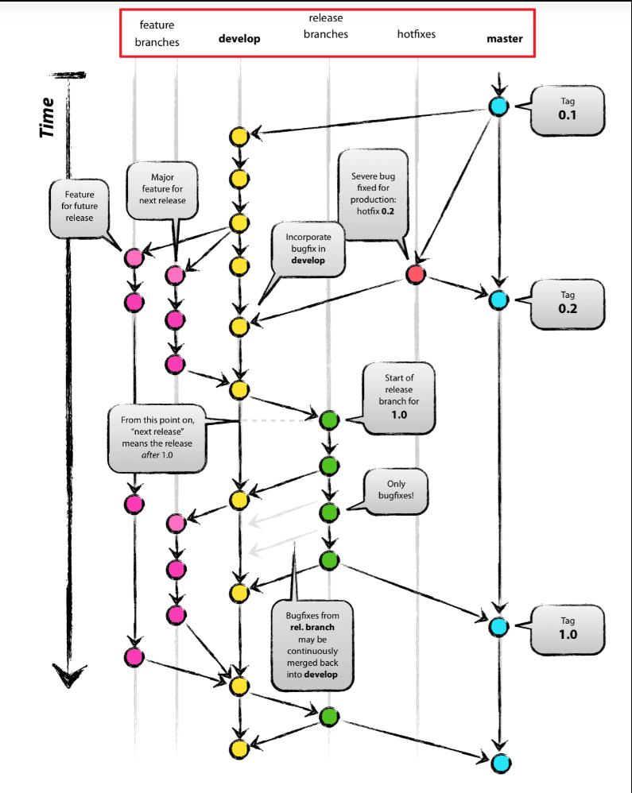
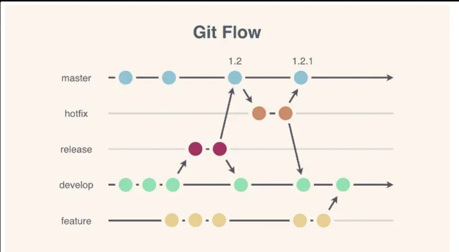
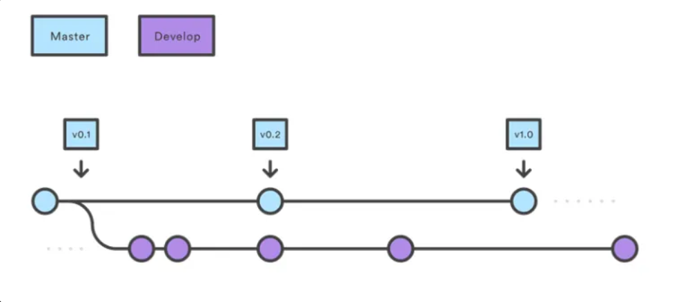
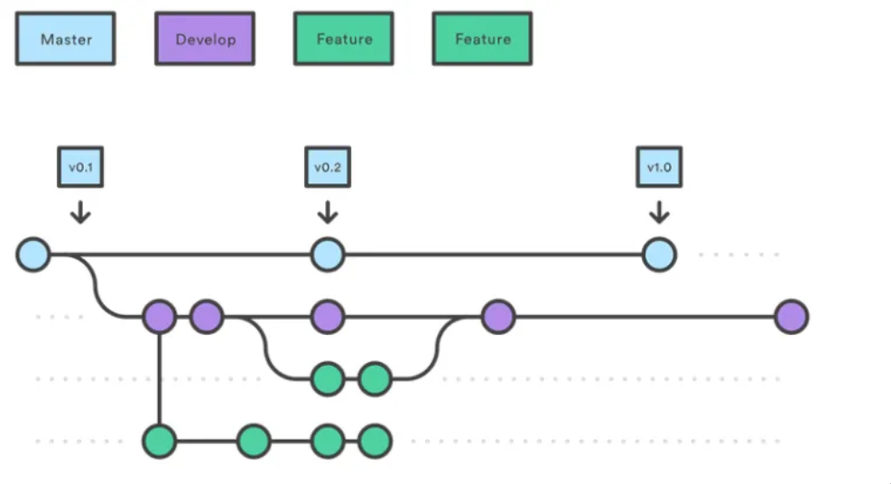
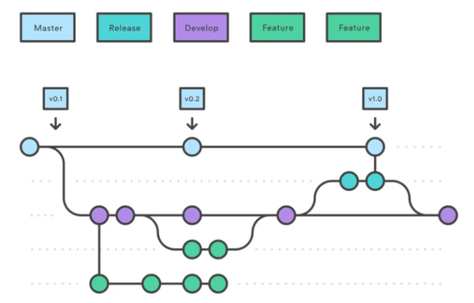
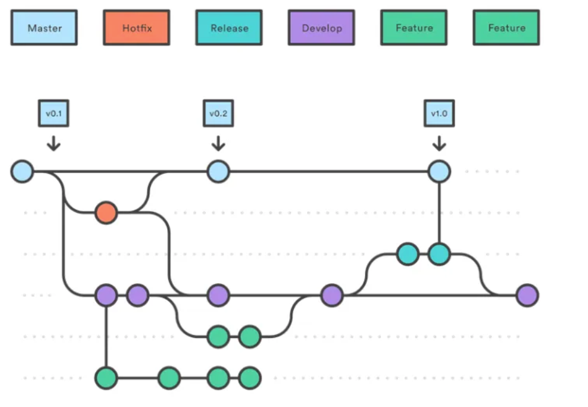
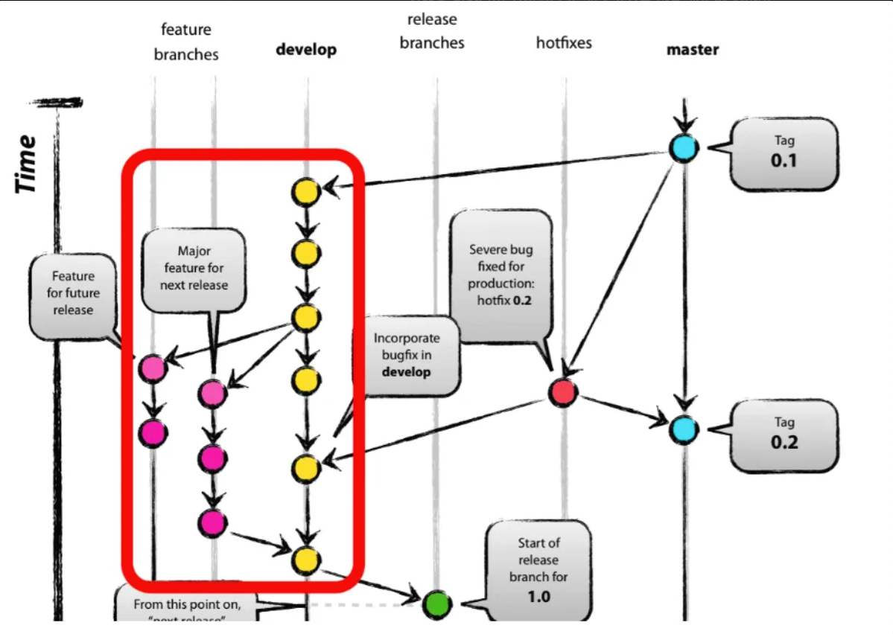
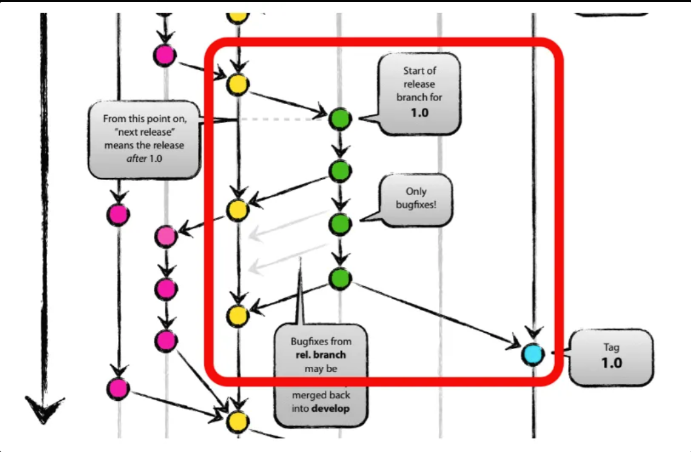
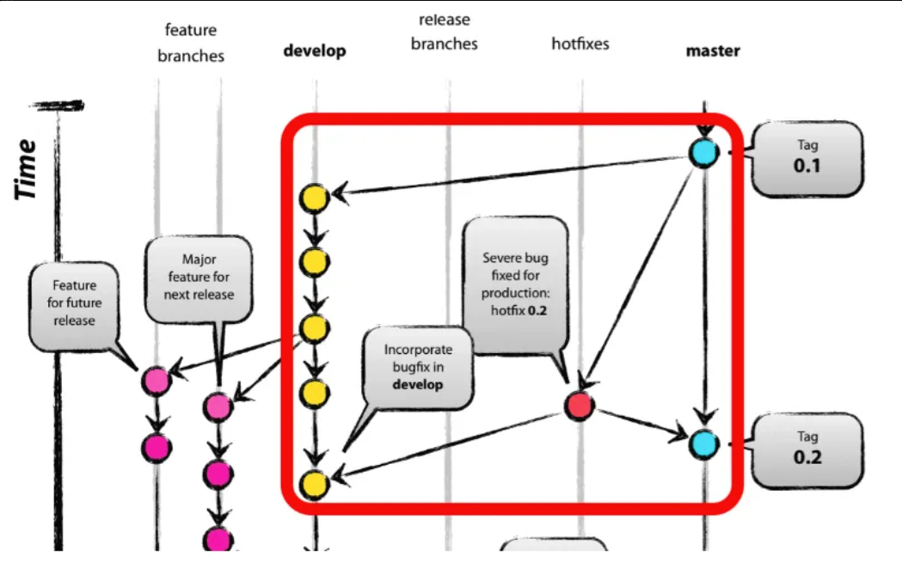

## Git Branch 전략

브랜치 전략이란 **여러 개발자가 하나의 저장소를 사용하는 환경에서 저장소를 효과적으로 활용하기 위한 work-flow입니다.**

브랜치의 생성, 삭제, 병합 등 git의 유연한 구조를 활용해서, 각 개발자들의 혼란을 최대한 줄이며 다양한 방식으로 소스를 관리하는 역할을 합니다.

즉, **브랜치 생성에 규칙을 만들어서 협업을 유연하게 하는 방법론** 입니다.

### **만일 브랜치 전략이 없으면?**

브랜치 전략이 없을 때 단점은

- 어떤 브랜치가 최신 브랜치지?
- 어떤 브랜치를 끌어와서 개발을 시작해야 하지?
- 어디에 Push를 보내야 하지?
- 핫픽스를 해야하는데 어떤 브랜치를 기준으로 수정해야할까?
- 배포 버전은 어떤 걸 골라야하지?

### 일반적으로 크게 두가지 전략이 있습니다.

### 1. Git-Flow 전략

### 2. Github-Flow 전략

상황에 따라 각 전략을 선택하거나 응용하고 커스텀해서 사용하는게 좋습니다.

---

## Git-Flow 전략

- 기본적인 가지의 이름은 feature > develop > release > hotfix > master 이 5가지로 구분하곤 합니다.
- 위 순서들은 왼쪽으로 갈수록 포괄적인 가지이고 master branch를 병합하게 되면 왼쪽에 있는 hotfix등 모든 가지들에 있는 커밋들도 병합이 되게 구성됩니다.
- 항시 유지되는 메인 브랜치 (master , develop) 와 merge되면 사라지는 보조 브랜치 (feature, release, hotfix) 로 구성됩니다.

## Gif-Flow Branch 구조

- **master** : 라이브 서버에 제품으로 출시 되는 브랜치.
- **develop** : 다음 출시 버전을 대비하여 개발 하는 브랜치.
- **feature** :  추가 기능 개발 브랜치. develop 브랜치에 들어간다.
- **release** :  다음 버전 출시를 준비하는 브랜치. develop 브랜치를 release 브랜치로 옮긴 후 QA, 테스트를 진행하고 master 브랜치로 합친다.
- **hotfix** : master 브랜치에서 발생한 버그를 수정하는 브랜채

### main Branch

main branch는 master와 develop branch를 말하며

master는 배포 가능한 상태만을 관리하는 브랜치이고
develop은 다음에 배포할 것을 개발하는 브랜치 입니다.

### 보조 Branch

feature branch 또는 topic branch 라고 하며 새로운 기능을 추가할때 주로 사용합니다.
master, develop, release-_,hotfix-_ 를 제외하면 자유롭게 이름 설정이 가능합니다.

**develop 브랜치에는 기존에 잘 작동하는 개발코드**가 담겨있으며,

**보조 브랜치는 새로 변경될 개발코드를 분리하고 각각 보존하는 역할**을 합니다.

즉, 보조 브랜치는 **기능을 다 완성할 때까지 유지하고, 다 완성되면 develop 브랜치로 merge 하고 결과가 좋지 못하면 버리는 방향**을 취합니다.

보조 브랜치는 보통 개발자 저장소에만 있는 브랜치고, origin에는 push하지 않습니다.

### release branch

릴리즈 브랜치는 배포를 위한 최종적인 버그 수정등의 개발을 수행하는 브랜치 입니다.

- **이름 설정** : release-\*
- 새로운 **제품을 배포**하고자 할 때 사용하는 가지입니다.

develop 브랜치에 버전에 포함되는 기능이 merge 되었다면 QA를 위해 develop 브랜치에서부터 release 브랜치를 생성합니다.

**배포 가능한 상태가 되면 master 브랜치로 병합**시키고, **출시된 master 브랜치에 버전 태그(ex, v1.0, v0.2)를 추가**합니다.

release 브랜치에서 기능을 점검하며 발견한 버그 수정 사항은 develop 브랜치에도 적용해줘야 합니다.

그러므로 배포 완료 후 develop 브랜치에 대해서도 merge 작업을 수행해야 합니다.

### Hotfix Branch

핫픽스 브랜치는 배포한 버전에서 긴급하게 수정할 필요가 있을 때 master 브랜치에서 분리하는 브랜치를 말합니다.

- **이름 설정** : hotfix-\*
- 제품에서 버그가 발생했을 경우에는 처리를 위해 이 가지로 해당 정보들을 모아줍니다. 버그에 대한 수정이 완료된 후에는 develop, master에 곧장 반영해주며 tag를 통해 관련 정보를 기록해둡니다.

버그를 잡는 사람이 일하는 동안에도 다른 사람들은 develop 브랜치에서 하던 일을 계속할 수 있습니다.

이 때 만든 hotfix 브랜치에서의 변경 사항은 develop 브랜치에도 merge 하여 문제가 되는 부분을 처리해줘야 합니다.

---

## **Git flow 흐름**

- 앞에서 적었던 기본 구조 5개 중 가장 많이 사용되는 가지는 master와 develop가 되며 정상적인 프로젝트를 진행하기 위해서는 둘 모두를 운용해야 합니다.

- 나머지 feature, release, hotfix branch는 사용하지 않는다면 지우더라도 오류가 발생하지 않기 때문에 깔끔한 프로젝트 진행을 원한다면 지워뒀다가 해당 가지를 활용해야 할 상황이 왔을 때 만들어줘도 괜찮습니다.

- 대부분의 작업은 develop에서 취합한다 생각하면 되며 테스트를 통해 정말 확실하게 더 이상 변동사항이 없다 싶을 때 master로의 병합을 진행하게 됩니다.

- master가 아닌 가지들은 master의 변동사항을 꾸준히 주시해야 합니다.

### 1. 신규 기능 개발

1. 개발자는 develop 브랜치로부터 본인이 신규 개발할 기능을 위한 feature 브랜치를 생성합니다.
2. feature 브랜치에서 기능을 완성하면 develop 브랜치에 merge를 진행하게 됩니다.

### 2. 라이브 서버로 배포

1. feature 브랜치들이 모두 develop 브랜치에 merge 되었다면 QA를 위해 release 브랜치를 생성합니다.
2. release 브랜치를 통해 오류가 확인된다면 release 브랜치 내에서 수정을 진행합니다.
3. QA와 테스트를 모두 통과했다면, 배포를 위해 release 브랜치를 master 브랜치 쪽으로 merge하며,
4. 만일 release 브랜치 내부에서 오류 수정이 진행되었을 경우 동기화를 위해 develop 브랜치 쪽에도 merge를 진행합니다.

### 3. 배포후 관리

1. 만일 배포된 라이브 서버(master)에서 버그가 발생된다면, hotfix 브랜치를 생성하여 버그 픽스를 진행합니다.
2. 그리고 종료된 버그 픽스를 master와 develop 양 쪽에 merge하여 동기화 시킵니다.

### 언제 Git-Flow를 선택해야할까?

1개월 이상의 긴 호흡으로 개발하여 주기적으로 배포, QA 및 테스트, hotfix 등 수행할 수 있는 여력이 있는 팀이라면 git-flow가 적합합니다
