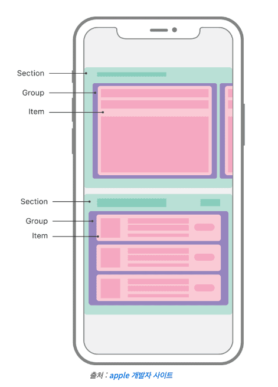
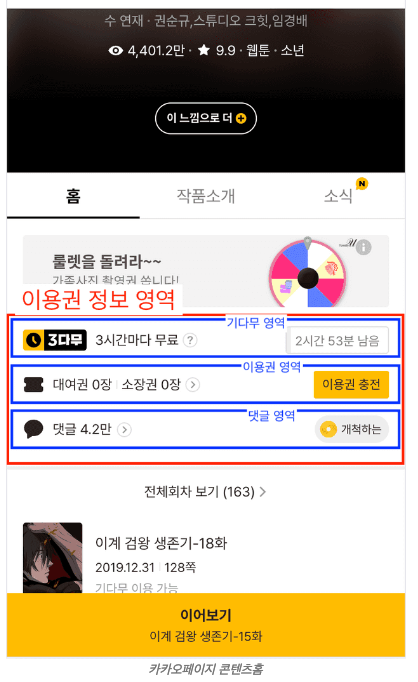

# SOLID 원칙이란

다음과 같은 5가지 원칙의 앞글자만 따온 단어이다.

SRP : Single Responsibility Principle
OCP : Open/Closed Principle
LSP : Liskov Substitution Principle
ISP : Interface Segregation Principle
DIP : Dependency Inversion Principle

---

## 콘웨이 법칙

SOLID는 원칙이다. 원칙은 지키면 좋고 이정표로 삼기 적당한 것이다.
원칙보다 우선하는 것은 법칙이다.

법칙은 하나의 현상으로 소프트웨어 공학에서 유명한 콘웨이 법칙은 SOLID 원칙의 대전제가 된다.

“소프트웨어 구조는 해당 소프트웨어를 개발한 조직의 커뮤니케이션 구조를 닮게 된다.” - 콘웨이

많은 의미중 하나는 " 소프트웨어 구조가 조직의 커뮤니케이션 구조와 다르다면 어딘가 잘못된 구조다" 라고 해석할수 있다.

소프트웨어를 만드는 것은 사람이다. 코드를 변경하는 요구사항도 사람간의 커뮤니케이션으로 접수된다.
요구사항도 시장 상황에 맞게 변경되는데 여기서 이상적인 구조는
변경된 요구사항이 전달되었을때 다른 컴포넌트의 영향이 가는 사이드 이펙트가 가지 않도록
원하는 부분만 변경할수 있는

응집도는 높고 결합도는 낮은 컴포넌트의 집합 구조이다. 조직간의 커뮤니케이션 방식과 소프트웨어 구조가 많이 다르면
커뮤니케이션 미스로 인해 어려운 구조가 될 가능성이 높다.

그래서 콘웨이 법칙에 입각해 소프트웨어 구조를 조직의 커뮤니케이션 구조와 유사하게 만들수 있도록 도와주는 원칙이
SRP 원칙이다.

## SRP : Single Responsibility Principle

단일 책임 원칙 으로.
책임 = 동작 으로 잘못 해석하는 경우가 있다.

즉 단일한 동작 만 가진 컴포넌트로 쪼개는 것이라고 오해할수 있는데

그것이 아닌 요구사항을 전달하는 책무 단위로 컴포넌트를 설계한다.

커뮤니케이션할때 컴포넌트 기반으로 커뮤니케이션 할수 있게 된다.

## OCP : Opoen-Closed Principle

OCP는 요구사항이 변경될 때 기존 코드를 변경하는 것이 아니라 새로운 코드를 추가하는 방향을 추구하는 원칙이다.

---

예를들어 섹션들이 있을때 서비스 운영도중 다양한 섹션들이 추가 변경 삭제되는것이 매우 명확하게 된다.

ex)
API가 아래와 같을경우

[{
type: "BANNER",
items: [...]
},
{
type: "RECENTLY_VIEWED",
items: [...]
}]

OCP를 적용하지 않으면

sections.map((section) => {
if(section.type === "BANNER"){
return section.items.map((item) => <Banner item={item} />);
} else if(type === "RECENTLY_VIEWED"){
return section.items.map((item) => <PosterView item={item} />);
}
}

이런 코드가 된다

이 코드는 확장에 닫혀있는 구조이고 섹션이 추가되면 else-if 를 추가해야한다.

OCP를 만족하기 위해서는

sections.map((section) =>

  <Section section={section}>
    {section.items.map((item) => 
      <Item section={section} item={item} />
    }
  </Section>

확장에 개방(open) 되었고 섹션을 추가/ 삭제해도 코드가 변경이 없다.

근데 만약 기획스팩이 변경된다면

기획) 기획이 변경되었습니다. 배너 중간에 광고를 노출해야합니다. 광고를 어디에 노출할지는 운영툴을 통해 세팅되구요.
API) 섹션에 광고를 나타내는 ad와 아이템 중간의 위치를 나타내는 ad_index 필드를 새로 팔께요.
web, ios, android) 넵

[{
type: "BANNER",
items: [...],
ad: "xxx",
ad_index: 3
},
{
type: "RECENTLY_VIEWED",
items: [...]
}]

지금 구조라면 프론트엔드 코드에도 많은 변화가 일어나야 한다.
섹션 구조의 OCP를 해결하기 위한 패턴이 여러가지 있는데, 애플 개발자 공식 문서에서 제안하고 있는 Compositional Layout 패턴을 예시로 들어본다.

섹션을 일반화 해보면 Section, Group, Item 형태로 대부분의 모습을 표현할 수 있다는 컨셉이다. 애플의 이 컨셉을 차용해 API 스펙 변경에도 OCP를 만족할 수 있도록 수정하면 다음과 같다.

function generateSections(apiSection) {
const sections = [];
for (section in apiSection) {
sections.push({
type: section.type,
groups: [{
items: section.items.map(factory)
}, ...(section.ad && {
items: [{
type: "AD",
key: section.ad
}]
}), ...(section.items_below_ad && {
items: section.items_below_ad.map(factory)
},
}]
}
}
...
const sections = generateSections(apiSection);
sections.map((section) =>

  <Section section={section}>
    {section.groups.map((group) => 
      <Group group={group}>
        {group.items.map((item) => 
          <Item item={item} />}
      </Group>}
  </Section>

## LSP : Liskov Substitution Principle

리스코프 치환 법칙는 일반적으로 클래스의 상속을 통해 설명하고 증명하지만 아키텍처 관점에서는

넓은 의미로 적용할수 있다.

상속관계를 이야기할때는 is-a 를 만족하는지의 여부로 상속 관계인지 판별할수 있다.

사과는 과일이다 같은 명확한 관계이다.

리스코프 치환법칙에서 이야기하고 하는 것은 상속(is-a)으로 이어진 관계에서 예상하지 못할 행동을 하지말라.

예를들어 실무 레벨에서 예상하지 못하는 예는

- Get Method 의 REST API로 정의했는데 실제 동작에선 DB상태를 변경
- API 응답으로 주기로 약속한 모델을 화면마다 다르게 내려줌(화면별로 필드 존재 유무가 달라지거나, nullable 여부가 달라지는)
- Label 이라 해놓고 체크 박스 기능 요구
- 필드명이 같은 것을 기준으로 타입스크립트 인터페이스 정의를 무지성으로 상속 관계로 만듦

실제로 SOLID 원칙중 버그와 가장 밀접하게 관련된 부분이 LSP 원칙이다.

인터페이스나 상위 정의된 부분과 실제 구현된 부분이 예상과 다르다면 잘못 사용하게 될수 있고 이슈 발생시 원인을 찾아내기 어려워진다.

상속 관계로 간주할수 있는 당연하게 여겨지는 명제가 예상과 다르게 펼쳐지는것이 LSP위반이다.

‘정의된 것과 달라 찝찝하지만 일정 상 어쩔 수 없으니 이대로 가자' 는 꼭 피하자

## ISP, DIP : Interface Segregation Principle, Dependency Inversion Principle

컴포넌트를 설계할 때 단일한 책무에 맞게 쪼개져 있다면 불필요한 속성(props) 없는 독립된 컴포넌트로 구성될 수 있다.
하지만 컴포넌트만 있으면 페이지를 완성할 수 없다.
페이지를 만들려면 컴포넌트들을 조합(composition)해야 한다.

인터페이스 분리 원칙(ISP)과 의존성 역전 법칙(DIP)은 컴포넌트를 조합할 때 큰 도움을 주는 원칙이다

### 예시

티켓 정보와 댓글 정보, 키워드 정보 총 세 개의 API를 통해서 그려주는 것으로 가정해 보자

function TicketInfoContainer(){
const { isLoading, data:ticketInfo, error } = useTicketInfoQuery();
const { data:commentInfo, error:commentApiError } = useCommentInfoQuery();
const { data:keywordInfo } = useKeywordInfoQuery();

if(isLoading){
return <Loading />
}

if(error){
return <Error />
}

return (
<TicketInfo
waitfreePeriod={ticketInfo.waitfreePeriod}
waitfreeChargedDate={ticketInfo.waitfreeChargedDate}
rentalTicketCount={ticketInfo.rentalTicketCount}
ownTicketCount={ticketInfo.ownTicketCount}
commentCount={commentInfo.commentCount}
commentError={commentApiError /_ 코멘트 에러 발생 시 재시도 버튼 추가해야함 _/}
keywordInfo={keywordInfo}
/>
)
}

크게 나빠보이진 않지만 아키텍처 관점에서 보면 조금 아쉬운 코드이다.

### 문제점

- 로딩과 에러 처리가 컴포넌트 내부에 섞여 중복될 가능성이 커진다.
- props가 너무 많아지면서 각 컴포넌트 간 결합도가 올라가 가독성이 떨어진다.
- 댓글 API 에러 처리 같은 로직이 TicketInfo로 들어가면서 단일 책임 원칙(SRP)을 어기게 된다.
- 이런 상황에서는 **의존성 역전 원칙(DIP)**을 사용해 컴포넌트 간 의존성을 낮춰야 한다.

### 1단계: Fetcher로 로딩과 에러 처리 분리하기

먼저, API의 로딩과 에러 처리를 Fetcher라는 컴포넌트로 따로 분리한다. 이렇게 하면 로직과 UI가 분리되고, 중복된 코드를 없앨 수 있다. Fetcher는 API 호출 결과에 따라 로딩 중이거나 에러가 발생했을 때 적절한 컴포넌트를 보여준다.

function Fetcher({ query, children }) {
const { isLoading, error, data } = query();

if (isLoading) return <Loading />;
if (error) return <Error />;

return children(data);
}

이제 Fetcher를 사용하면 로딩, 에러 상태 처리가 더 이상 개별 컴포넌트 안에 남아있지 않게 된다. children을 통해 필요한 데이터가 준비됐을 때만 하위 컴포넌트를 렌더링할 수 있다.

### 2단계: TicketInfoContainer 리팩터링

Fetcher를 사용해 TicketInfoContainer를 리팩터링한다. 각각의 API를 호출하고, 데이터를 준비한 뒤에 필요한 부분에만 전달하도록 한다. 이렇게 하면 API 호출과 UI 로직이 분리되어 관리가 훨씬 쉬워진다.

function TicketInfoContainer() {
const TicketInfoFetcher = useFetcher(useTicketInfoQuery);
const KeywordInfoFetcher = useFetcher(useKeywordInfoQuery);
const CommentInfoFetcher = useFetcher(useCommentInfoQuery);

return (
<TicketInfoFetcher>
{(ticketData) => (
<TicketInfo>
<TicketInfo.WaitfreeArea
waitfreePeriod={ticketData.waitfreePeriod}
waitfreeChargedDate={ticketData.waitfreeChargedDate}
/>
<TicketInfo.TicketArea
rentalTicketCount={ticketData.rentalTicketCount}
ownTicketCount={ticketData.ownTicketCount}
/>
<KeywordInfoFetcher>
{(keywordData) => (
<CommentInfoFetcher>
{(commentData) => (
<TicketInfo.CommentArea
commentCount={commentData.commentCount}
keywordInfo={keywordData.keywordInfo}
/>
)}
</CommentInfoFetcher>
)}
</KeywordInfoFetcher>
</TicketInfo>
)}
</TicketInfoFetcher>
);
}

이제 각각의 API 호출은 Fetcher에서 처리되며, 필요한 데이터만 하위 컴포넌트에 전달된다. 이 구조에서는 로딩과 에러 처리가 TicketInfo와 분리되면서 의존성이 낮아진다.

### 3단계: useFetcher 훅 만들기

Fetcher를 반복적으로 사용하는 대신, useFetcher 훅을 만들어 코드를 더 단순화한다. 이 훅을 사용하면 코드가 짧아지고 재사용성이 높아진다.

function useFetcher(query) {
const { isLoading, error, data } = query();

return ({ children }) => (
<Fetcher query={query}>
{(data) => children(data)}
</Fetcher>
);
}

이제 필요한 곳에서 useFetcher를 호출해 사용하면 된다.

### 4단계: 컴파운드 패턴으로 TicketInfo 세분화

TicketInfo는 컴파운드 패턴을 사용해 더 작은 단위로 나눈다. 이렇게 하면 각 영역이 독립적으로 관리되고, 코드 가독성도 높아진다.

<TicketInfo>
  <TicketInfo.WaitfreeArea 
    waitfreePeriod={waitfreePeriod} 
    waitfreeChargedDate={waitfreeChargedDate} 
  />
  <TicketInfo.TicketArea 
    rentalTicketCount={rentalTicketCount} 
    ownTicketCount={ownTicketCount} 
  />
  <TicketInfo.CommentArea 
    commentCount={commentCount} 
    keywordInfo={keywordInfo} 
  />
</TicketInfo>

### 마무리

이제 TicketInfoContainer는 SRP(단일 책임 원칙)를 준수하면서 API 호출과 UI 로직이 분리된 상태다. DIP(의존성 역전 원칙) 덕분에 로딩, 에러 처리가 독립적으로 관리되고, 컴포넌트 간 결합도도 낮아진다.

이렇게 리팩터링을 하면 유연한 아키텍처를 만들 수 있다. 코드가 더 읽기 쉬워지고, 필요한 부분만 고쳐도 되기 때문에 유지보수가 편리해진다.

참고 : https://fe-developers.kakaoent.com/2024/240116-common-component/
