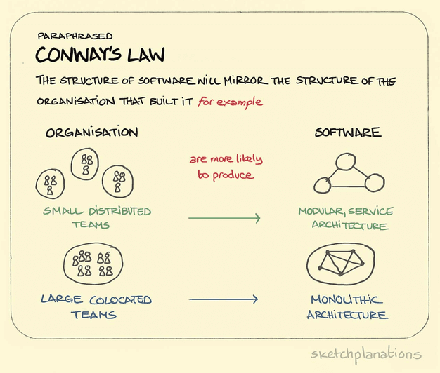

# SOLID 원칙이란

다음과 같은 5가지 원칙의 앞글자만 따온 단어이다.

SRP : Single Responsibility Principle
OCP : Open/Closed Principle
LSP : Liskov Substitution Principle
ISP : Interface Segregation Principle
DIP : Dependency Inversion Principle

---

## 콘웨이 법칙

SOLID는 원칙이다. 원칙은 지키면 좋고 이정표로 삼기 적당한 것이다.
원칙보다 우선하는 것은 법칙이다.

법칙은 하나의 현상으로 소프트웨어 공학에서 유명한 콘웨이 법칙은 SOLID 원칙의 대전제가 된다.

“소프트웨어 구조는 해당 소프트웨어를 개발한 조직의 커뮤니케이션 구조를 닮게 된다.” - 콘웨이

많은 의미중 하나는 " 소프트웨어 구조가 조직의 커뮤니케이션 구조와 다르다면 어딘가 잘못된 구조다" 라고 해석할수 있다.

소프트웨어를 만드는 것은 사람이다. 코드를 변경하는 요구사항도 사람간의 커뮤니케이션으로 접수된다.
요구사항도 시장 상황에 맞게 변경되는데 여기서 이상적인 구조는
변경된 요구사항이 전달되었을때 다른 컴포넌트의 영향이 가는 사이드 이펙트가 가지 않도록
원하는 부분만 변경할수 있는

응집도는 높고 결합도는 낮은 컴포넌트의 집합 구조이다. 조직간의 커뮤니케이션 방식과 소프트웨어 구조가 많이 다르면
커뮤니케이션 미스로 인해 어려운 구조가 될 가능성이 높다.

그래서 콘웨이 법칙에 입각해 소프트웨어 구조를 조직의 커뮤니케이션 구조와 유사하게 만들수 있도록 도와주는 원칙이
SRP 원칙이다.

## SRP : Single Responsibility Principle

단일 책임 원칙 으로.
책임 = 동작 으로 잘못 해석하는 경우가 있다.

즉 단일한 동작 만 가진 컴포넌트로 쪼개는 것이라고 오해할수 있는데

그것이 아닌 요구사항을 전달하는 책무 단위로 컴포넌트를 설계한다.

커뮤니케이션할때 컴포넌트 기반으로 커뮤니케이션 할수 있게 된다.

## OCP : Opoen-Closed Principle

OCP는 요구사항이 변경될 때 기존 코드를 변경하는 것이 아니라 새로운 코드를 추가하는 방향을 추구하는 원칙이다.

---

예를들어 섹션들이 있을때 서비스 운영도중 다양한 섹션들이 추가 변경 삭제되는것이 매우 명확하게 된다.

ex)
API가 아래와 같을경우

[{
type: "BANNER",
items: [...]
},
{
type: "RECENTLY_VIEWED",
items: [...]
}]

OCP를 적용하지 않으면

sections.map((section) => {
if(section.type === "BANNER"){
return section.items.map((item) => <Banner item={item} />);
} else if(type === "RECENTLY_VIEWED"){
return section.items.map((item) => <PosterView item={item} />);
}
}

이런 코드가 된다

이 코드는 확장에 닫혀있는 구조이고 섹션이 추가되면 else-if 를 추가해야한다.

OCP를 만족하기 위해서는

sections.map((section) =>

  <Section section={section}>
    {section.items.map((item) => 
      <Item section={section} item={item} />
    }
  </Section>

확장에 개방(open) 되었고 섹션을 추가/ 삭제해도 코드가 변경이 없다.

근데 만약 기획스팩이 변경된다면

기획) 기획이 변경되었습니다. 배너 중간에 광고를 노출해야합니다. 광고를 어디에 노출할지는 운영툴을 통해 세팅되구요.
API) 섹션에 광고를 나타내는 ad와 아이템 중간의 위치를 나타내는 ad_index 필드를 새로 팔께요.
web, ios, android) 넵

[{
type: "BANNER",
items: [...],
ad: "xxx",
ad_index: 3
},
{
type: "RECENTLY_VIEWED",
items: [...]
}]

지금 구조라면 프론트엔드 코드에도 많은 변화가 일어나야 한다.
섹션 구조의 OCP를 해결하기 위한 패턴이 여러가지 있는데, 애플 개발자 공식 문서에서 제안하고 있는 Compositional Layout 패턴을 예시로 들어본다.

섹션을 일반화 해보면 Section, Group, Item 형태로 대부분의 모습을 표현할 수 있다는 컨셉이다. 애플의 이 컨셉을 차용해 API 스펙 변경에도 OCP를 만족할 수 있도록 수정하면 다음과 같다.

function generateSections(apiSection) {
const sections = [];
for (section in apiSection) {
sections.push({
type: section.type,
groups: [{
items: section.items.map(factory)
}, ...(section.ad && {
items: [{
type: "AD",
key: section.ad
}]
}), ...(section.items_below_ad && {
items: section.items_below_ad.map(factory)
},
}]
}
}
...
const sections = generateSections(apiSection);
sections.map((section) =>

  <Section section={section}>
    {section.groups.map((group) => 
      <Group group={group}>
        {group.items.map((item) => 
          <Item item={item} />}
      </Group>}
  </Section>
