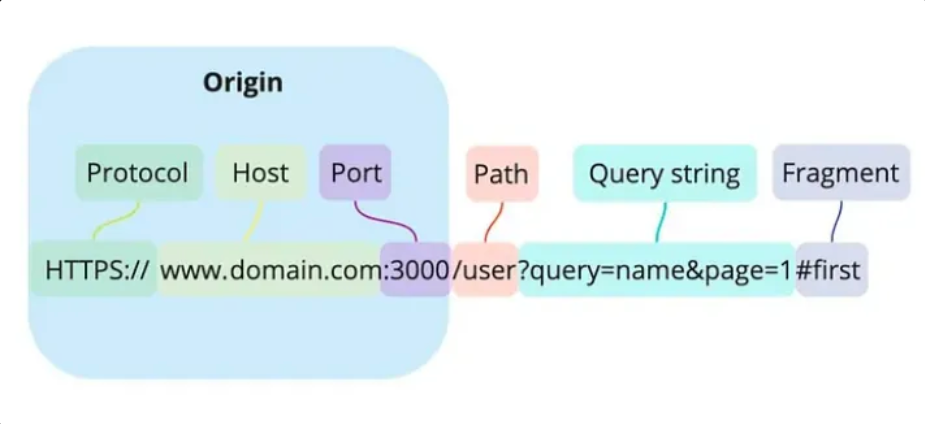
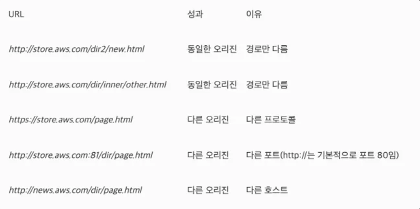
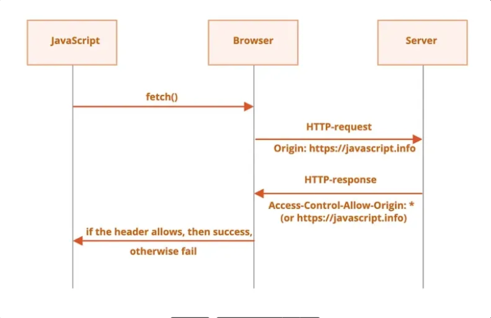

# CORS

### CORS 란

CORS는 **Cross-Origin Resource Sharing**의 약자로, 교차 출처 리소스 공유라고도 부른다.

이는 한 출처(Origin A)에서 다른 출처(Origin B)의 리소스를 요청할 때 발생하는 현상으로, 2009년에 HTML5 표준으로 채택된 프로토콜이다.

CORS는 보안상의 이유로 동일 출처 정책(Same-Origin Policy, SOP)에 의해 제한된 교차 출처 리소스 요청을 허용하기 위한 방식이다.

### CORS 에러 발생 원인

CORS 에러는 **Access-Control-Allow-Origin** 헤더가 적절히 설정되지 않은 경우 발생할 수 있다. 에러 메시지가 이 헤더의 필요성을 언급할 때는 다음 두 가지 해결 방법이 있다.

1. **서버에서 Access-Control-Allow-Origin 헤더를 설정**하여 요청을 허용하는 방법이 있다.
2. **프록시 서버를 활용**하여 프론트엔드와 동일한 출처에서 요청을 보내는 방법이 있다.

### 프록시 서버와 CORS

- CORS는 브라우저에서만 발생하며, 서버 간 요청이나 수정된 브라우저 환경에서는 나타나지 않는다.
- 프록시 서버는 프론트엔드와 동일한 출처에서 동작하므로, 브라우저에서 CORS 문제가 발생하지 않는다.
- 프록시 서버와 백엔드 간의 통신은 서버 간 요청이므로 CORS 오류가 발생하지 않는다.

---

### 도메인과 오리진의 차이

웹에서 **도메인**과 **오리진**은 서로 다른 개념으로, CORS와 같은 보안 정책에서 중요한 역할을 한다.

### 도메인이란?

도메인은 주로 3단계 구조로 구성된다.

1. **하위 도메인 (Subdomain)**: 예를 들어 `blog.example.com`에서 `blog` 부분.
2. **도메인 (Domain)**: `example.com`처럼 주된 이름을 가리키는 부분.
3. **최상위 도메인 (Top Level Domain)**: `.com`, `.net`, `.org`와 같은 확장자.

이처럼 도메인은 URL에서 주로 호스트를 나타내며, 특정 웹사이트나 리소스를 가리키기 위한 고유한 주소를 의미한다.

### 오리진이란?

- \*오리진 (Origin)**은 URL에서 **프로토콜(Protocol)**, **호스트(Host, 도메인)**, **포트 번호(Port)\*\*를 합친 것을 의미한다. 일반적으로 오리진은 다음과 같은 구조로 이루어진다.
- **예시**: `https://example.com:443`

여기서 오리진은 **https**라는 프로토콜, **example.com**이라는 호스트, **443**이라는 포트를 포함하며, 이 세 가지 요소가 모두 일치해야 같은 오리진으로 간주된다.

### 오리진과 포트 번호

일반적으로 URL에서 포트 번호는 생략 가능하다. 그 이유는 웹에서 사용하는 프로토콜인 HTTP와 HTTPS의 기본 포트 번호가 각각 80과 443으로 정해져 있기 때문이다. 예를 들어, `https://google.com`은 포트를 명시하지 않더라도 HTTPS의 기본 포트 443이 적용된다.

그러나, `https://google.com:443`과 같이 포트 번호가 명시적으로 포함된 경우, **포트 번호까지 모두 일치해야 같은 오리진으로 인정된다**. 이는 웹 보안에서 중요한 기준이 된다.

---

### SOP란

SOP는 **Same Origin Policy**의 약자로, **동일 출처 정책**을 의미한다.

이는 1990년대 후반에 등장한 보안 정책으로, 현재 출처와 동일한 출처의 리소스만 접근할 수 있도록 하는 정책이다.

SOP에서 동일 출처는 **도메인**, **프로토콜**, **포트 번호**가 모두 같은 경우를 의미한다. 이 중 하나라도 다를 경우, 동일 출처 정책에 의해 리소스 접근이 제한된다. 동일 출처 정책은 매우 강력한 보안 수단이지만, 유연성이 떨어진다는 단점이 있다.

오늘날의 브라우저에서는 클라이언트가 클라이언트의 URL 과 동일한 오리진의 리소스로만 요청을 보낼수 있다.

클라이언트 URL의 프로토콜, 포트 및 호스트 이름은 모두 클라이언트에서 요청하는 서버와 일치해야 한다.

예를 들어 아래 URL의 오리진과 클라이언트 URL *http://store.aws.com/dir/page.html*의 오리진을 비교하면 아래와 같다.

동일 오리진 정책은 매우 안전하지만 실제 사용 사례에는 유연하지 않다.

\*크로스 오리진 리소스 공유(CORS)\*\*는 동일 출처 정책을 확장한 것으로, 외부 출처의 리소스에 대해 승인을 거쳐 제한적으로 접근할 수 있도록 허용하는 정책이다.

예를 들어:

공개되거나 승인된 외부 API에서 데이터를 가져올 때.

권한이 있는 서드 파티가 서버 리소스에 접근하도록 허용할 때.

이처럼 외부의 서드 파티와 리소스를 안전하게 공유하려면 CORS가 필요하다.

### SOP가 없을 경우 발생할 수 있는 보안 취약점

SOP가 없다면, 사용자의 인증 정보에 해당하는 **세션 ID**와 같은 민감한 정보가 쉽게 노출될 수 있다. 이러한 정보는 주로 **쿠키**에 포함되어 있으며, 공격자가 이를 탈취할 경우 **Cross-Site Scripting (XSS)**, **Cross-Site Request Forgery (CSRF)**와 같은 해킹 공격에 악용될 수 있다.

예를 들어, 악의적인 웹사이트가 사용자의 세션 정보를 훔쳐 서버에 접근하거나, 사용자를 가장해 요청을 보낼 수 있다. SOP는 이러한 보안 문제를 방지하기 위해 다른 도메인에서 리소스 접근을 제한하여, 민감한 정보가 외부로 유출되지 않도록 보호하는 역할을 한다. SOP를 통해 이러한 해킹 공격을 어느 정도 완화할 수 있다.

### CORS 프로토콜이 동작하는 과정

CORS는 클라이언트가 교차 출처에 요청을 보내는 경우, 해당 요청이 서버에 의해 승인되었는지 확인하기 위해 사용된다.

1. **클라이언트의 요청**

   클라이언트가 HTTP 요청을 보낼 때, `Origin` 헤더에 클라이언트의 출처 URL을 담아 서버로 전송한다.

2. **서버의 응답**

   서버는 응답 헤더에 `Access-Control-Allow-Origin` 헤더를 포함해, 요청을 승인할 출처를 지정한다. 특정 출처만 허용하거나, `*`(와일드카드)를 사용하여 모든 출처를 허용할 수도 있다.

3. **브라우저의 확인**

   브라우저는 클라이언트의 요청 `Origin`과 서버의 `Access-Control-Allow-Origin` 값을 비교하여, 일치하지 않으면 요청을 차단하고 응답을 버린다.

4. **브라우저에서 지원하는 CORS API**

   최신 브라우저는 `XMLHttpRequest`나 `Fetch API`에서 CORS를 사용하여 교차 출처 HTTP 요청을 관리한다. 서버는 CORS 관련 헤더(`Access-Control-Allow-Origin`, `Access-Control-Allow-Methods`, `Access-Control-Allow-Headers`)를 설정하여 요청을 허용할 출처, HTTP 메서드, 요청 헤더 종류를 정의할 수 있다.

---

### Simple Request와 Preflight Request

CORS 프로토콜 스펙에서는 보안적으로 비교적 민감하지 않은 요청을 **단순 요청(Simple Request)**으로 정의하며, 이러한 요청은 별도의 확인 없이 서버로 전송된다. 반면, 단순 요청이 아닌 모든 CORS 요청에는 실제 요청을 전송하기 전에 허가를 위한 **Preflight 요청**이 발생할 수 있다.

### Simple Request란?

보안적으로 민감하지 않다고 간주되는 요청은 단순 요청으로 분류되며, 별도의 Preflight 요청 없이 바로 요청이 진행된다.

**단순 요청의 조건**:

- HTTP 메서드가 `GET`, `HEAD`, `POST` 중 하나일 때.
- 헤더가 자동 설정되는 `Accept`, `Accept-Language`, `Content-Language` 등을 제외하고 추가 헤더가 설정되지 않은 경우.
- `Content-Type`이 `application/x-www-form-urlencoded`, `multipart/form-data`, `text/plain` 중 하나인 경우.

이 조건에 부합하면 단순 요청으로 처리되며, 별도 확인 없이 요청을 서버로 보낸다.

---

### Preflight 요청이란?

보안적으로 민감한 요청의 경우, 브라우저는 실제 요청을 보내기 전 **Preflight 요청**을 통해 서버에 요청 승인 여부를 확인한다.

**Preflight 요청 과정**:

- 브라우저는 `OPTIONS` 메서드를 사용해 헤더만 전송하여 서버에 요청한다.
- 서버는 응답 헤더에서 허용된 출처, 메서드, 헤더 종류 등을 설정해 반환한다.
- 브라우저는 서버 응답의 헤더 값을 통해 요청이 허용되었는지 확인하며, 만약 허용되지 않았다면 요청을 차단하고 에러를 발생시킨다. 허용된 요청이라면, 이후 원래 요청을 다시 보내 리소스를 응답받는다.

**Preflight 요청이 항상 발생하는가?**
모든 CORS 요청에 Preflight 요청이 발생하지는 않는다. 단순 요청이거나, 서버에서 `Access-Control-Max-Age` 헤더를 통해 응답을 캐싱한 경우, 캐싱된 응답을 사용하여 Preflight 요청이 생략될 수 있다.
